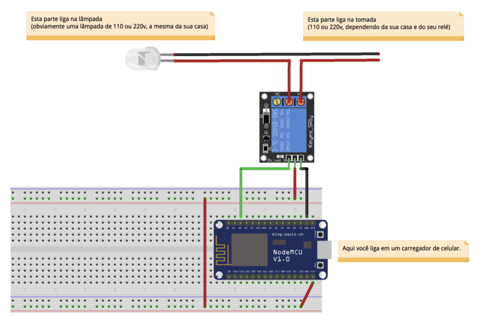

# Safehouse - 2019-2

- [Safehouse - 2019-2](#safehouse---2019-2)
    - [Projeto Acadêmico](#projeto-acadêmico)
      - [Arquitetura da Aplicação](#arquitetura-da-aplicação)
      - [Maquete](#maquete)
    - [Tecnologias](#tecnologias)
      - [Softwares:](#softwares)
      - [Hardwares:](#hardwares)
    - [Contribuições Pessoais](#contribuições-pessoais)
      - [Hard Skills](#hard-skills)
      - [Soft Skills](#soft-skills)
    - [Menu de Navegação](#menu-de-navegação)

### Projeto Acadêmico

Parceiro Acadêmico: [FATEC Prof. Jessen Vidal - Faculdade de Tecnologia de São José dos Campos](http://fatecsjc-prd.azurewebsites.net/).

O tema proposto tem como objetivo compreender o funcionamento do sistema de automação residencial de baixo custo, utilizando a integração entre diversos equipamentos e dispositivos motorizados e automatizados em uma maquete que conversam entre si e interagem com um servidor web (aplicativo), podendo ser controlados à distância através de celulares, tabletes ou computadores conectados a rede ou internet. A automação de uma casa define-se em comodidade, segurança e economia. Cada dispositivo de uma casa poderá ser automatizado, como por exemplo, acender a lâmpada, abrir portão, ligar condicionador de ar e alarme. A Safehouse surge como um serviço de automação residencial voltado para a iluminação, agindo sob o intuito de gerar maior segurança aos residentes que, presentes ou não, consigam acender/apagar as lâmpadas de suas casas através de aplicativo com suporte web Server.

[Safehouse - Automação LED](https://github.com/charles-ramos/Automa-o-de-LED-via-html)

[Documentação completa](https://github.com/charles-ramos/Automa-o-de-LED-via-html/blob/master/Safehouse.pdf)
  
#### Arquitetura da Aplicação

  
 
 

Conexão componentes de hardware:

  

#### Maquete

Apresentação da solução:

  
  

### Tecnologias

As tecnologias utilizadas na solução, foram:

#### Softwares:

- [AppInventor](https://appinventor.mit.edu/): para desenvolvimento da aplicação mobile;
- [Arduino IDE](https://www.arduino.cc/en/software): Para implementação do código de integração com o hardware;
- [Firebase](https://firebase.google.com/) para integração com o webserver.

#### Hardwares:

- Módulo WiFi ESP8266 NodeMCU ESP-12;
- Protoboard 640 Pontos 1 Barra Sem Suporte.
  
### Contribuições Pessoais

Utilizando a metodologia SCRUM, desempenhei o papel de Master, onde pude acompanhar o desenvolvimento do projeto e também contribuir com o time com atividades adicionais. Minhas principais contribuições foram:

- Definição de requisitos, com ideias de brainstorming e pesquisas iniciais;
  
- Desenvolvimento da conexão do software à internet;
  
- Gerenciamento da equipe, para divisão das atividades;
  
- Cálculo de custos da solução como negócio e desenvolvimento da [apresentação do produto](https://github.com/charles-ramos/Automa-o-de-LED-via-html/blob/master/Apresentac%CC%A7a%CC%83o%20Projeto.pdf).

#### Hard Skills

Tecnologia | Classificação
:---------: | :------:
Integração de Software com web servers através do App Inventor     | Sei fazer com autonomia
Conhecimento de tecnologias e desenvolvimento de soluções IOT    | Faço com ajuda
Firebase    | Faço com ajuda

#### Soft Skills

Habilidade | Classificação
:---------: | :------:
Metodologia SCRUM    | Faço com ajuda
Trabalho em equipe    | Faço com ajuda

### Menu de Navegação

[Retonar ao Readme principal](https://github.com/charles-ramos/Portfolio-Charles-Ferreira-Ramos)

Ver próximo projeto [VisualData - 2020-1](https://github.com/charles-ramos/Portfolio-Charles-Ferreira-Ramos/blob/master/Projetos/VisualData.md)

Se interessou? Entre em contato comigo [Charles Ramos](https://bit.ly/charlesramos)