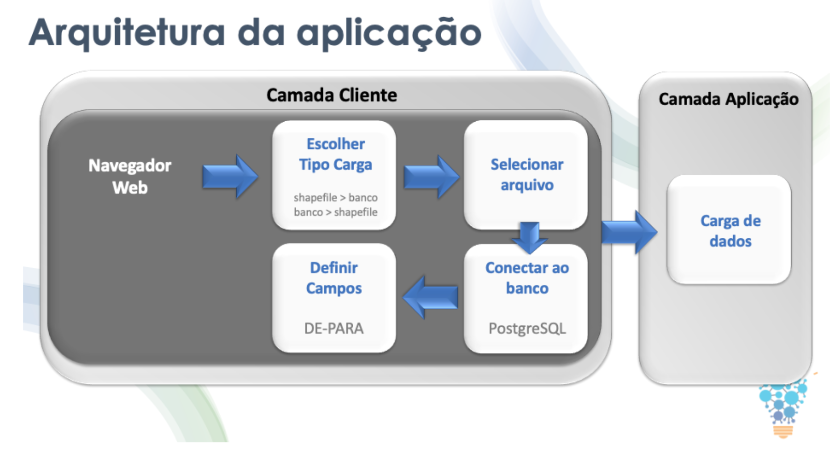

### ShapeGIS - 2020-2	
- [ShapeGIS - 2020-2](#shapegis---2020-2)
  - [Arquitetura da Aplicação](#arquitetura-da-aplicação)
  - [Demonstração da Solução](#demonstração-da-solução)
- [Tecnologias Utilizadas](#tecnologias-utilizadas)
- [Contribuições pessoais](#contribuições-pessoais)
  - [Hard Skills](#hard-skills)
  - [Soft Skills](#soft-skills)
- [Menu de Navegação](#menu-de-navegação)

Parceiro Acadêmico: [Visiona Tecnologia Espacial](https://visionaespacial.com.br/)

​O tema proposto foi conduzido a partir da necessidade, da empresa parceira, de Extrair, Transformar e Carregar dados de arquivos do tipo [Shapefile](https://pt.wikipedia.org/wiki/Shapefile) para sua base de dados e o caminho inverso, gerar arquivos Shapefile de dados registrador em sua base de dados, devida limitação de licenças da solução que utilizara.

​ShapeGIS fora desenvolvido para atender essa necessidade, uma aplicação Web com interface intuitiva, desenvolvida com base nas heurísticas de [Jakob Nielsen](https://www.nngroup.com/people/jakob-nielsen/), utilizadas tecnologias atuais como ReactJS, Spring Boot e como linguagem de programação Java para Fack-End e JavaScript para interações no Front-End.

[ShapeGIS](https://github.com/BureauTech/Mini-ETL-Shapefile-to-PostGis)

#### Arquitetura da Aplicação

  

#### Demonstração da Solução

Também é possível ver o vídeo de apresentação da solução [neste link](hhttps://www.youtube.com/watch?v=Vg5b7eITRV8).

### Tecnologias Utilizadas

- [Java](https://www.java.com/pt-BR/): Linguagem de programação para desenvolvimento Back-End;	
- [ReactJS](https://reactjs.org/): Biblioteca para acelerar o desenvolvimento da interface;	
- [Spring](https://spring.io/): Framework para acelerar o desenvolvimento do Back-End;	
- [Hibernate](https://hibernate.org/): Framework para persistência de dados;
- [psql2shp](https://postgis.net/): Aplicação utilizada para gerar Shape Files a partir do banco de dados;	
- [Astah](https://astah.net/): Para modelagem do Diagrama de Caso de Uso, de Classes, DER e MER;	
- [Git](https://git-scm.com/): Para controle de versionamento;	
- [GitHub](https://github.com/): Para gerenciamento e armazenamento do projeto.	

### Contribuições pessoais

​Desempenhei o papel de PO (Product Owner) e também de desenvolvedor, utilizando a metodologia SCRUM, onde pude, além de contribuir no desenvolvimento dos artefatos da solução, desenvolver, implementar e documentar as telas e integrá-las com o back-end para a execução da solução. Minhas contribuições foram:

- Levantamento de requisitos com o cliente;

- Definição dos requisitos (Design Thinking);
  
- Definição dos artefatos da solução, disponíveis [neste link](https://github.com/BureauTech/Mini-ETL-Shapefile-to-PostGis/tree/sprint-4/docs)

- Desenvolvimento funcional das telas da solução;

- Integração do Frontend com a API para realização das cargas dos arquivos (nos dois fluxos)

Todas as contribuições estão diponíveis [aqui](https://github.com/BureauTech/Mini-ETL-Shapefile-to-PostGis/blob/sprint-4/docs/Contribui%C3%A7%C3%B5es%20da%20Equipe_v6.pdf)

#### Hard Skills

|      Tecnologia      |   Classificação   |
| :------------------: | :---------------: |
|         Java         |  Faço com ajuda   |
|       ReactJS        |  Faço com ajuda   |
|       psql2shp       |  Faço com ajuda   |
|        Astah         | Faço com autonomia |
|        GitHub        | Utilizo com autonomia |

#### Soft Skills

|     Habilidade     |   Classificação    |
| :----------------: | :----------------: |
| Metodologia SCRUM  | Faço com autonomia |
| Trabalho em equipe | Faço com autonomia |
|  Design Thinking   | Faço com autonomia |

### Menu de Navegação

[Retonar ao Readme principal](https://github.com/charles-ramos/Portfolio-Charles-Ferreira-Ramos)

Ver projeto anterior [VisualData - 2020-1](https://github.com/charles-ramos/Portfolio-Charles-Ferreira-Ramos/blob/master/Projetos/VisualData.md)

Ver próximo projeto [SISATAS - 2021-1](https://github.com/charles-ramos/Portfolio-Charles-Ferreira-Ramos/blob/master/Projetos/SISATAS.md)