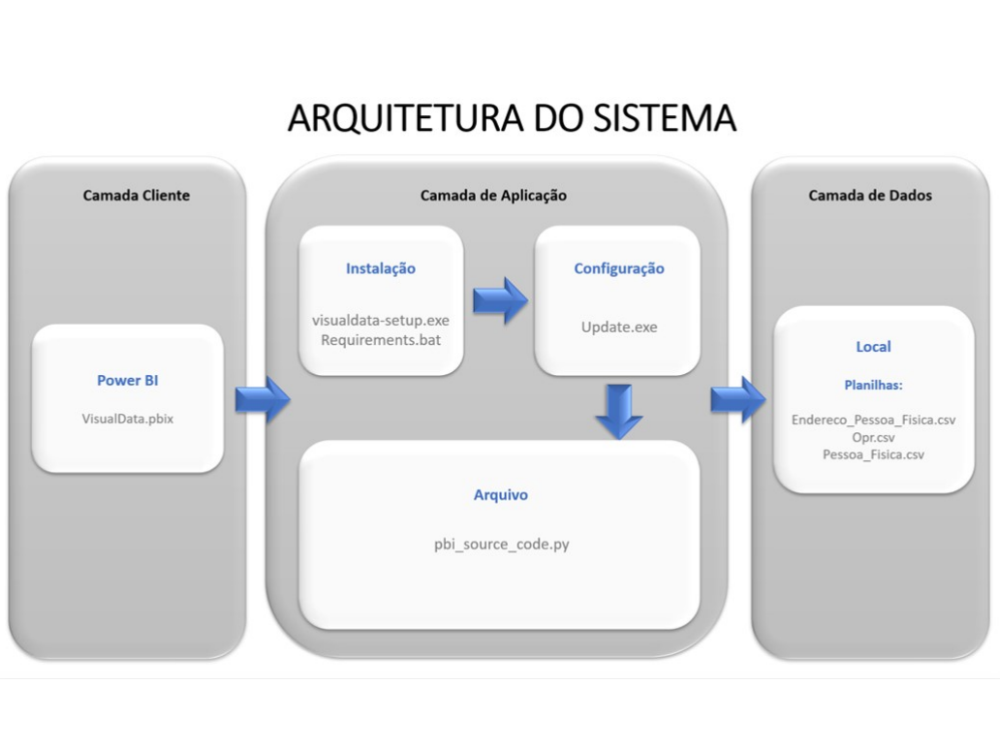

# 2020-1
- [2020-1](#2020-1)
      - [Arquitetura da Aplicação](#arquitetura-da-aplicação)
      - [Demonstração da Solução](#demonstração-da-solução)
    - [Tecnologias](#tecnologias)
    - [Contribuições Pessoais](#contribuições-pessoais)
      - [Hard Skills](#hard-skills)
      - [Soft Skills](#soft-skills)

Parceiro Acadêmico: [SPC Brasil](https://www.spcbrasil.org.br/).

O tema proposto foi conduzido a partir de uma ideia sobre como poderíamos através de dados oriundos da nova Lei do Cadastro Positivo, que vigorou a partir de 09/07/2019, no qual a entrada do consumidor pessoa física ou jurídica passou a ser automática, que resultou na geração de uma grande massa de dados, gerar valor desses dados obtidos através do vigor dessa lei.

​Devido ao cenário do momento, com a queda drástica de veículos emplacados no acúmulo anual, se comparado ao ano anterior, de acordo com o [relatório](http://www.fenabrave.org.br/portalv2/Conteudo/Emplacamentos) de maio/2020 da Fenabrave. Este problema afeta as operadoras de crédito, fabricantes e concessionárias de veículos; Há baixa demanda, diminuindo a quantidade de financiamentos e influenciando seus resultados financeiros. Gerando déficit de vendas e da fabricação de veículos e geração de estoque. Fabricantes e concessionárias precisam se adaptar aos novos desafios que o cenário do momento exige.

​Visual Data tem como objetivo orientar fabricantes de veículos a ofertarem seus produtos de maneira mais assertiva de acordo com a demanda da região que deseja atuar. Deste modo, é possível otimizar seus processos, tais com, logística, produção, publicidade, redução de custos, localização e contratação de seus fornecedores.

[VisualData](https://github.com/BureauTech/PI-SPCBrasil-2020)

[Documento de Visão da Aplicação](https://github.com/BureauTech/PI-SPCBrasil-2020/blob/master/%40documentation/Documento%20de%20Visao%20-%20v6.pdf)

#### Arquitetura da Aplicação

  

#### Demonstração da Solução

 

Também é possível ver o vídeo de apresentação da solução [neste link](https://www.youtube.com/watch?v=FWIq11U5yv4).

### Tecnologias

As tecnologias utilizadas na solução, foram:

- [Microsoft Power BI](https://powerbi.microsoft.com/pt-br/): Para organização e apresentação dos dados;	
  
- [Python](https://www.python.org/): Linguagem de programação para Extração, Transformação e Carregamento dos dados;	
  
- [Pandas](https://pandas.pydata.org/): Biblioteca da linguagem Python, para o cruzamento e normalização dos dados;
  	
- [Matplotlib](https://matplotlib.org/): Biblioteca da linguagem Python, para a construção de gráficos;	
  
- [Inno Setup](https://jrsoftware.org/isinfo.php): Utilizado para criar o instalador da solução;	
  
- [Astah](https://astah.net/): Para modelagem do Diagrama de Caso de Uso e de Classes;
    
- [GitHub](https://github.com/): Para gerenciamento e armazenamento do projeto.	 

### Contribuições Pessoais

Utilizando a metodologia SCRUM, desempenhei o papel de PO (Product Owner), onde pude acompanhar o desenvolvimento do projeto e também contribuir com o time com atividades adicionais. Minhas principais contribuições foram:

- Alinhamento de expectativas e levantamento de Requisitos com o cliente;
  
- Contribuição de ideias para desenvolvimento da solução;
  
- Criação dos artefatos exigidos pelo cliente. Todas os documentos estão disponíveis [neste link](https://github.com/BureauTech/PI-SPCBrasil-2020/tree/master/%40documentation).
  
- Testes da solução.

#### Hard Skills

|     Tecnologia     |   Classificação   |
| :----------------: | :---------------: |
| Microsoft Power BI |  Faço com ajuda   |
|       Python       |  Faço com ajuda   |
|       Pandas       |  Faço com ajuda   |
|     Matplotlib     |  Faço com ajuda   |
|     Inno Setup     |  Faço com ajuda   |
|       Astah        | Faço com autonomia |
|       GitHub       | Utilizo com autonomia |

#### Soft Skills

| Habilidade         | Classificação  |
| ------------------ | -------------- |
| Metodologia SCRUM  | Faço com ajuda |
| Trabalho em equipe | Faço com ajuda |
| Design Thinking    | Faço com ajuda |

[Retonar ao Readme principal](https://github.com/charles-ramos/Portfolio-Charles-Ferreira-Ramos)

Ver projeto anterior [Safehouse - 2019-2](https://github.com/charles-ramos/Portfolio-Charles-Ferreira-Ramos/blob/master/Projetos/Safehouse.md)

Ver próximo projeto [ShapeGIs - 2020-2](https://github.com/charles-ramos/Portfolio-Charles-Ferreira-Ramos/blob/master/Projetos/ShapeGIS.md)
