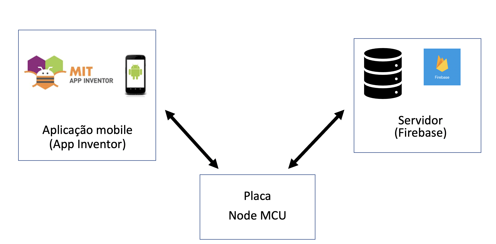
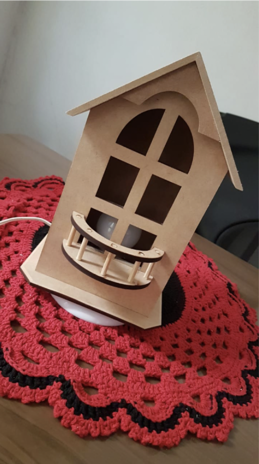

# Portfolio - Charles Ferreira Ramos

Apresentação dos projetos desenvolvidos de todos os APIs (Aprendizagem por Projetos Integrados), programa oferecido pela [FATEC Prof. Jessen Vidal - Faculdade de Tecnologia de São José dos Campos](http://fatecsjc-prd.azurewebsites.net/).

# Sumário

  * [Portfolio - Charles Ferreira Ramos](#portfolio---charles-ferreira-ramos)
  * [Sobre Mim](#sobre-mim)
  * [Projetos Acadêmicos](#projetos-acadêmicos)
    * [Em 2019-2](#em-2019-2)
      * [Arquitetura da Aplicação](#arquitetura-da-aplicação)
      * [Maquete](#maquete)
      * [Tecnologias](#tecnologias)
        * [Softwares](#softwares)
        * [Hardwares](#hardwares)
      * [Contribuições Pessoais](#contribuições-pessoais)
      * [Hard Skills](#hard-skills)
      * [Soft Skills](#soft-skills)
    * [Em 2020-1](#em-2020-1)
      * [Arquitetura da Aplicação](#arquitetura-da-aplicação-1)
      * [Demonstração](#demonstracao-da-solução)
      * [Tecnologias](#tecnologias-1)
      * [Contribuições Pessoais](#contribuições-pessoais-1)
      * [Hard Skills](#hard-skills-1)
      * [Soft Skills](#soft-skills-1)

## Sobre mim

Formado em Administração de empresas e atualmente aluno do 5° semestre do curso de Análise e Desenvolvimento de Sistemas da [FATEC Prof. Jessen Vidal - Faculdade de Tecnologia de São José dos Campos](http://fatecsjc-prd.azurewebsites.net/). Sou também Analista de Suporte de TI pela [Back4App](https://back4app.com) desde 2019.

Fui palestrante convidado para a edição 2021 do Technovation Girls Brasil, uma ONG que promove a inclusão de meninas de baixa renda à tecnologia a realizar um workshop sobre o App Inventor. Para saber mais sobre minha participação, [clique aqui](https://www.youtube.com/watch?v=I8StXM3tiWo).

Também realizei a publicação de alguns artigos tutoriais de como criar app templates de players de refência no mercado, sendo eles:

- [Como criar um aplicativo como o Airbnb?](https://blog.back4app.com/pt/como-criar-um-aplicativo-como-o-airbnb/)

- [Como criar um aplicativo clone do YouTube?](https://blog.back4app.com/pt/como-criar-um-aplicativo-clone-do-youtube/)

- [Como criar um clone do Uber?](https://blog.back4app.com/pt/como-criar-um-clone-do-uber/)

- [Como criar um clone do WhatsApp?](https://blog.back4app.com/pt/como-criar-um-clone-do-whatsapp/)

E também artigos comparativos de conceitos, serviços, plataformas e tecnologias:

- [As 7 principais alternativas ao Appcelerator](https://blog.back4app.com/pt/alternativas-appcelerator/)

- [BaaS vs FaaS – Qual a diferença?](https://blog.back4app.com/pt/baas-vs-faas-qual-a-diferenca/)

- [Melhores serviços de back-end para aplicativos móveis](https://blog.back4app.com/pt/backend-aplicativos/)

- [O que é o Backend como serviço?](https://blog.back4app.com/pt/o-que-e-o-backend-como-servico/)

- [Fornecedores de backend para jogos de celular](https://blog.back4app.com/pt/backend-jogos/)

- [Backend as a Service – O que é?](https://blog.back4app.com/pt/backend-as-a-service/)

- [As melhores alternativas ao Firebase em 2021](https://blog.back4app.com/pt/as-melhores-alternativas-ao-firebase-em-2021/)

- [Baas vs PaaS: Qual é a melhor opção?](https://blog.back4app.com/pt/baas-vs-paas-qual-e-a-melhor-opcao/)

- [Quais são os melhores mBaaS Open Source?](https://blog.back4app.com/pt/melhores-mbaas-open-source/)

- [IaaS vs PaaS – Qual a diferença?](https://blog.back4app.com/pt/iaas-vs-paas-qual-a-diferenca/)

- [MBaaS vs PaaS – Qual a diferença?](https://blog.back4app.com/pt/mbaas-vs-paas-qual-a-diferenca/)

- [Os recursos básicos de BaaS que você deve considerar](https://blog.back4app.com/pt/baas-funcionalidades/)

- [Backend as a Service – 20 provedores de BaaS](https://blog.back4app.com/pt/backend-service/)

- [Quais projetos são mais adequados para o BaaS?](https://blog.back4app.com/pt/baas-exemplos-apps/)

## Projetos Acadêmicos

### Em 2019-2

Parceiro Acadêmico: [FATEC Prof. Jessen Vidal - Faculdade de Tecnologia de São José dos Campos](http://fatecsjc-prd.azurewebsites.net/).

O tema proposto tem como objetivo compreender o funcionamento do sistema de automação residencial de baixo custo, utilizando a integração entre diversos equipamentos e dispositivos motorizados e automatizados em uma maquete que conversam entre si e interagem com um servidor web (aplicativo), podendo ser controlados à distância através de celulares, tabletes ou computadores conectados a rede ou internet. A automação de uma casa define-se em comodidade, segurança e economia. Cada dispositivo de uma casa poderá ser automatizado, como por exemplo, acender a lâmpada, abrir portão, ligar condicionador de ar e alarme. A Safehouse surge como um serviço de automação residencial voltado para a iluminação, agindo sob o intuito de gerar maior segurança aos residentes que, presentes ou não, consigam acender/apagar as lâmpadas de suas casas através de aplicativo com suporte web Server.

[Safehouse - Automação LED](https://github.com/charles-ramos/Automa-o-de-LED-via-html)

[Documentação completa](https://github.com/charles-ramos/Automa-o-de-LED-via-html/blob/master/Safehouse.pdf)
  
#### Arquitetura da Aplicação

  
 
 

Conexão componentes de hardware:

  

#### Maquete

Apresentação da solução:

  
  

### Tecnologias

As tecnologias utilizadas na solução, foram:

#### Softwares:

- [AppInventor](https://appinventor.mit.edu/): para desenvolvimento da aplicação mobile;
- [Arduino IDE](https://www.arduino.cc/en/software): Para implementação do código de integração com o hardware;
- [Firebase](https://firebase.google.com/) para integração com o webserver.

#### Hardwares:

- Módulo WiFi ESP8266 NodeMCU ESP-12;
- Protoboard 640 Pontos 1 Barra Sem Suporte.
  
### Contribuições Pessoais

Utilizando a metodologia SCRUM, desempenhei o papel de Master, onde pude acompanhar o desenvolvimento do projeto e também contribuir com o time com atividades adicionais. Minhas principais contribuições foram:

- Definição de requisitos, com ideias de brainstorming e pesquisas iniciais;
  
- Desenvolvimento da conexão do software à internet;
  
- Gerenciamento da equipe, para divisão das atividades;
  
- Cálculo de custos da solução como negócio e desenvolvimento da [apresentação do produto](https://github.com/charles-ramos/Automa-o-de-LED-via-html/blob/master/Apresentac%CC%A7a%CC%83o%20Projeto.pdf).

#### Hard Skills

Tecnologia | Classificação
:---------: | :------:
Integração de Software com web servers através do App Inventor     | Sei fazer com autonomia
Conhecimento de tecnologias e desenvolvimento de soluções IOT    | Faço com ajuda
Firebase    | Faço com ajuda

#### Soft Skills

Habilidade | Classificação
:---------: | :------:
Metodologia SCRUM    | Faço com ajuda
Trabalho em equipe    | Faço com ajuda

### Em 2020-1

Parceiro Acadêmico: [SPC Brasil](https://www.spcbrasil.org.br/).

O tema proposto foi conduzido a partir de uma ideia sobre como poderíamos através de dados oriundos da nova Lei do Cadastro Positivo, que vigorou a partir de 09/07/2019, no qual a entrada do consumidor pessoa física ou jurídica passou a ser automática, que resultou na geração de uma grande massa de dados, gerar valor desses dados obtidos através do vigor dessa lei.

​Devido ao cenário do momento, com a queda drástica de veículos emplacados no acúmulo anual, se comparado ao ano anterior, de acordo com o [relatório](http://www.fenabrave.org.br/portalv2/Conteudo/Emplacamentos) de maio/2020 da Fenabrave. Este problema afeta as operadoras de crédito, fabricantes e concessionárias de veículos; Há baixa demanda, diminuindo a quantidade de financiamentos e influenciando seus resultados financeiros. Gerando déficit de vendas e da fabricação de veículos e geração de estoque. Fabricantes e concessionárias precisam se adaptar aos novos desafios que o cenário do momento exige.

​Visual Data tem como objetivo orientar fabricantes de veículos a ofertarem seus produtos de maneira mais assertiva de acordo com a demanda da região que deseja atuar. Deste modo, é possível otimizar seus processos, tais com, logística, produção, publicidade, redução de custos, localização e contratação de seus fornecedores.

[VisualData](https://github.com/BureauTech/PI-SPCBrasil-2020)

[Documento de Visão da Aplicação](https://github.com/BureauTech/PI-SPCBrasil-2020/blob/master/%40documentation/Documento%20de%20Visao%20-%20v6.pdf)

#### Arquitetura da Aplicação

  
 

#### Demonstração da Solução

 

Também é possível ver o vídeo de apresentação da solução [neste link](https://www.youtube.com/watch?v=FWIq11U5yv4).

### Tecnologias

As tecnologias utilizadas na solução, foram:

- [Microsoft Power BI](https://powerbi.microsoft.com/pt-br/): Para organização e apresentação dos dados;	
  
- [Python](https://www.python.org/): Linguagem de programação para Extração, Transformação e Carregamento dos dados;	
  
- [Pandas](https://pandas.pydata.org/): Biblioteca da linguagem Python, para o cruzamento e normalização dos dados;
  	
- [Matplotlib](https://matplotlib.org/): Biblioteca da linguagem Python, para a construção de gráficos;	
  
- [Inno Setup](https://jrsoftware.org/isinfo.php): Utilizado para criar o instalador da solução;	
  
- [Astah](https://astah.net/): Para modelagem do Diagrama de Caso de Uso e de Classes;
    
- [GitHub](https://github.com/): Para gerenciamento e armazenamento do projeto.	 

### Contribuições Pessoais

Utilizando a metodologia SCRUM, desempenhei o papel de PO (Product Owner), onde pude acompanhar o desenvolvimento do projeto e também contribuir com o time com atividades adicionais. Minhas principais contribuições foram:

- Alinhamento de expectativas e levantamento de Requisitos com o cliente;
  
- Contribuição de ideias para desenvolvimento da solução;
  
- Criação dos artefatos exigidos pelo cliente. Todas os documentos estão disponíveis [neste link](https://github.com/BureauTech/PI-SPCBrasil-2020/tree/master/%40documentation).
  
- Testes da solução.

#### Hard Skills

|     Tecnologia     |   Classificação   |
| :----------------: | :---------------: |
| Microsoft Power BI |  Faço com ajuda   |
|       Python       |  Faço com ajuda   |
|       Pandas       |  Faço com ajuda   |
|     Matplotlib     |  Faço com ajuda   |
|     Inno Setup     |  Faço com ajuda   |
|       Astah        |  Faço com ajuda   |
|       GitHub       | Utilizo com ajuda |

#### Soft Skills

| Habilidade         | Classificação  |
| ------------------ | -------------- |
| Metodologia SCRUM  | Faço com ajuda |
| Trabalho em equipe | Faço com ajuda |
| Design Thinking    | Faço com ajuda |

